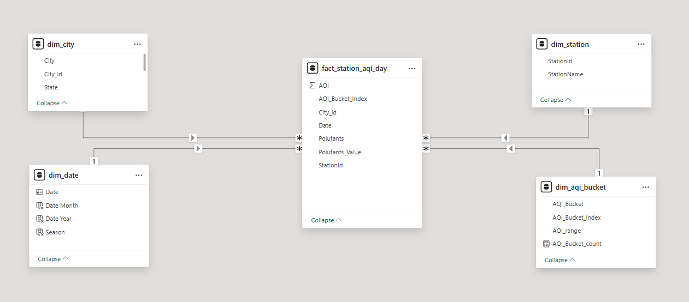
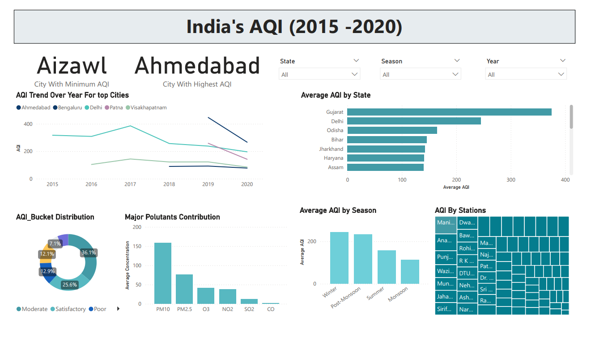

# 🌏 Air-Pollution-Monitoring-Insights-Dashboard-India (2015–2020)

## 📌 Background & Overview
Air pollution has been rising globally—and particularly in India—posing serious risks to public health and the environment.  
This project analyzes **publicly available Air Quality Index (AQI) data** published by the **Central Pollution Control Board (CPCB)** for the years **2015 to 2020**.

Using Power BI, the analysis focuses on:
- City-level pollution patterns  
- Major contributing pollutants  
- Seasonal variations  
- State-wise air quality differences  

The goal is to highlight actionable insights so policymakers and the public can strategize better by **targeting specific pollutants in specific cities**.

---

## 🗂️ Data Model Overview (Star Schema)

A star schema was used to structure the data model for efficient analysis and visualization.

**Schema Diagram:**  

---

## 📊 Key Insights

### 🏙️ City-Level AQI Insights
- **Most Polluted Cities:** Ahmedabad, Delhi, Talcher  
- **Least Polluted Cities:** Aizawl, Shillong, Coimbatore  

### 🧪 Major Contributing Pollutants
- **PM10** – Highest concentration  
- **PM2.5** – Major contributor across multiple cities  
- **O₃ (Ozone)** – Significant in several regions  

### 🌦️ Seasonal AQI Patterns
- **Winter** and **Post-Monsoon** seasons show the **highest pollution levels**  
- Summer and Monsoon seasons comparatively show lower AQI

---

## 📝 Recommendations

- **City-specific pollutant targeting**  
  Authorities should design interventions focusing on the exact pollutant dominating each city.

- **Season-based pollution control strategies**  
  Since winter and post-monsoon pollution spikes are consistent, pollution management efforts should intensify before these months.

- **Focus on particulate pollution (PM10 & PM2.5)**  
  These remain the largest contributors across India and require priority action.

- **Improve monitoring & reporting**  
  Expanding real-time monitoring stations will enable more granular insights.

---

## 📈 Dashboard Snapshot  
 

---

